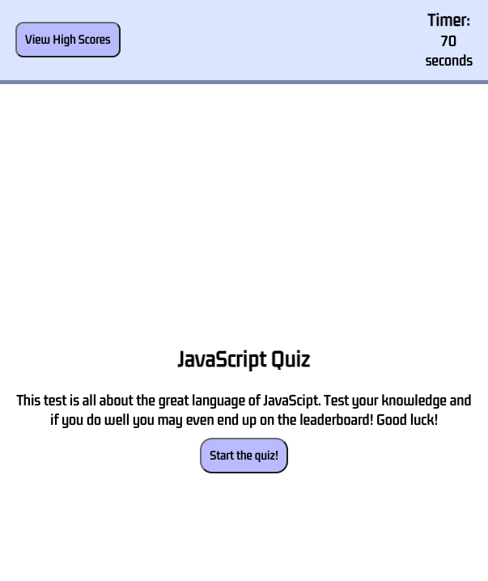
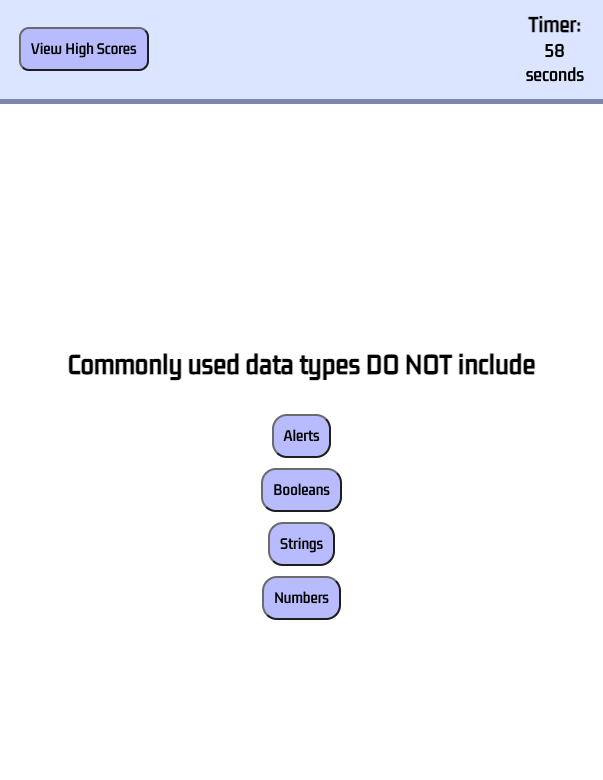
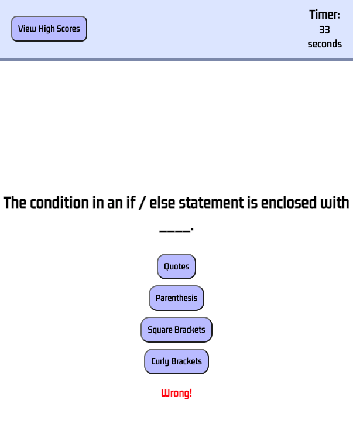
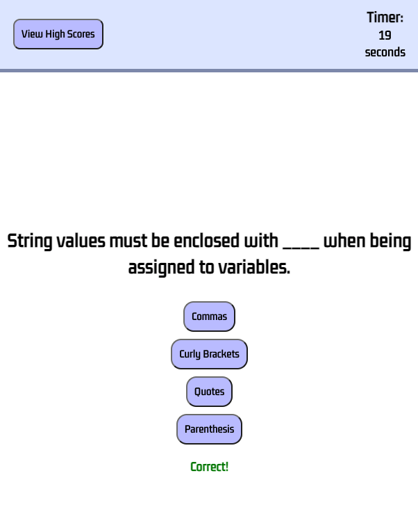
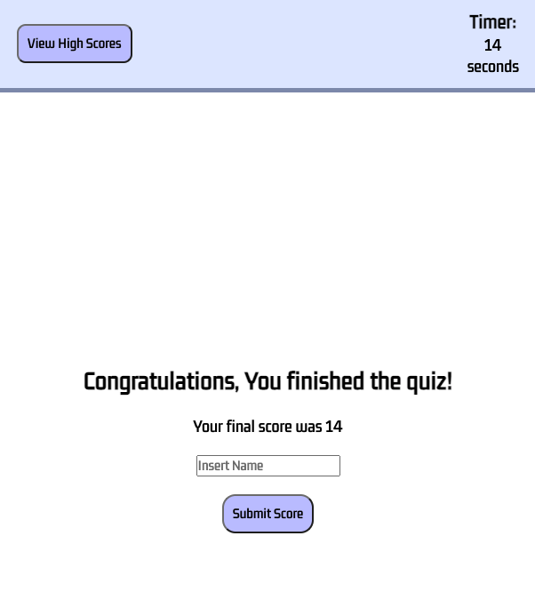
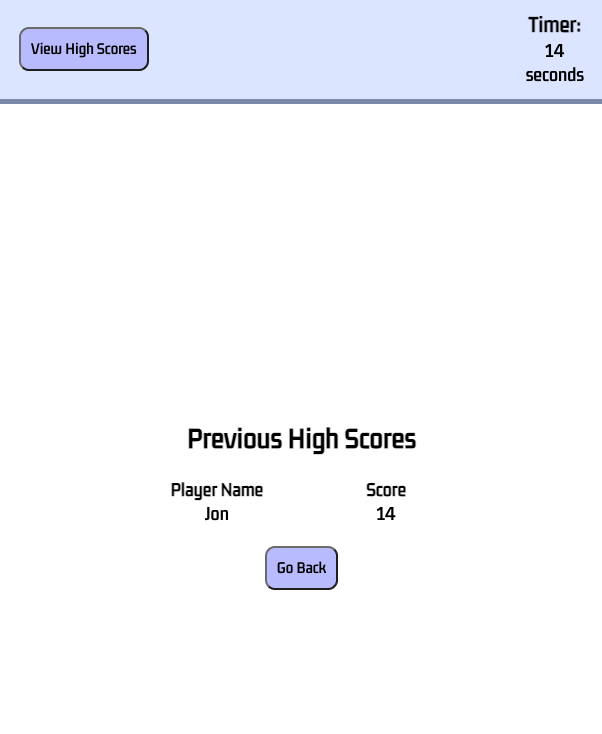

# Dan-Smith-04-Quiz-Web-APIs

**Description**

This project is a JavaScript quiz where users can text their knowledge about the great language.
Some of the applications features are showcased in the screenshots below

**Mockup Website Link**

Website link:
https://dansmith09.github.io/Dan-Smith-04-Quiz-Web-APIs/

**Website Section Screenshots**

When you open the website you are given some information about the quiz, the timer is shown at 70 seconds, there is a button in the top left to view previous high scores and a button in the center of the screen to start the quiz.

Once you click the start quiz button you will be presented with the first question and the timer will begin counting down.

If you get an answer wrong a red comment will show and 10 seconds will be taken off the timer in order to penalise your lack of knowledge.

If you answer correctly, a green comment will appear and you will be shown the next question without any time penalties.

Once you have answered all the questions, you will be congratulated, the timer will stop and will become your final score.

Once you submit your score, you will be able to see it on the previous high score board!

